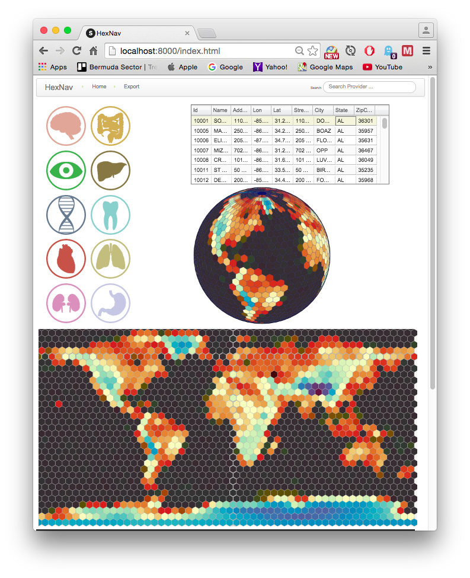

# HexNav - Covering Earth with Hexagonal Map Tiles

Many strategy games use hexagonal tiles. One of the main advantages is that the
distance between the center of any tile and all its neighboring tiles is the
same.

We wonder if marrying a hexagonal tile system with the traditional geographic
system (longitude/latitude) will provide a better reasoning and visual
perception.

## How to Run

Go into HexNav directory, install depending Node modules by,

```
npm install
```

Now, you can start the HexNav app

```
node app.js
```

Navigate from the browser to http://localhost:8000 (default port 8000) to see the main page.



# References

## Medical Infographics
http://all-free-download.com/free-vector/download/vector_medical_infographics_human_body_with_internal_organs_568889.html

Vector medical infographics human body with internal organs Free vector 202.00KB
File size: 202.00KB File type: Encapsulated PostScript eps ( .eps ) format Author: cgvector
Licence: Free for non commercial use only , Please check author page for more information.

## Medical Inpatient Data
CMS Centers for Medicare & Medicaid Services publication

### Overview
https://www.cms.gov/research-statistics-data-and-systems/statistics-trends-and-reports/medicare-provider-charge-data/inpatient.html

The data provided here include hospital-specific charges for the more than 3,000
U.S. hospitals that receive Medicare Inpatient Prospective Payment System (IPPS)
payments for the top 100 most frequently billed discharges, paid under Medicare
based on a rate per discharge using the Medicare Severity Diagnosis Related
Group (MS-DRG) for Fiscal Year (FY) 2012. These DRGs represent more than 7
million discharges or 60 percent of total Medicare IPPS discharges.

### Download Data
Medicare Fee-For Service Provider Utilization & Payment Data Inpatient Public Use File
https://www.cms.gov/Research-Statistics-Data-and-Systems/Statistics-Trends-and-Reports/Medicare-Provider-Charge-Data/Inpatient2012.html

Data file downloaded: Medicare_Provider_Charge_Inpatient_DRG100_FY2012.csv
https://www.cms.gov/Research-Statistics-Data-and-Systems/Statistics-Trends-and-Reports/Medicare-Provider-Charge-Data/Downloads/Inpatient_Data_2012_CSV.zip

## Geodesic Discrete Global Grid Systems
Read "Geodesic Discrete Global Grid Systems" by Kevin Sahr, Denis White, and A. Jon Kimerling

You can find it here...
http://webpages.sou.edu/~sahrk/dgg/pubs/gdggs03.pdf

## HexGrid Math
http://www.redblobgames.com/grids/hexagons/

The first website that comes to mind is Amit's Game Programming Information and
its collection of links on hexagonal grids.

## Spinning Globe
Mike Bostock's code for the spinning globe found here:
Transparent spinning globe
http://bl.ocks.org/mbostock/6747043

## Syntagmatic (by Kai Chang)
Hexbin Height Map
http://bl.ocks.org/syntagmatic/1092fe86860def004ea7

## SlickGrid
Find documentation and examples in [the wiki](https://github.com/mleibman/SlickGrid/wiki).
